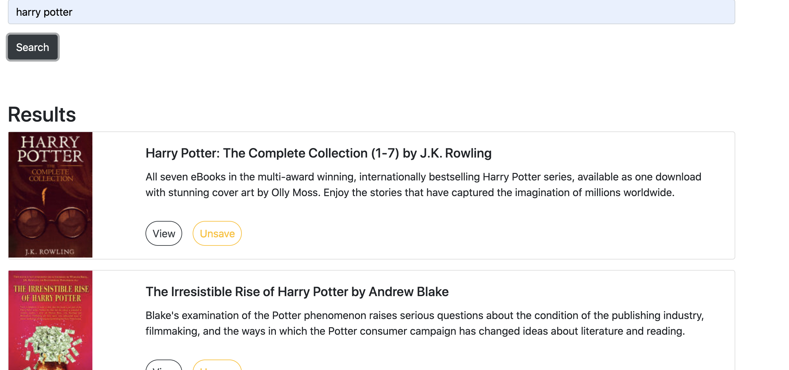
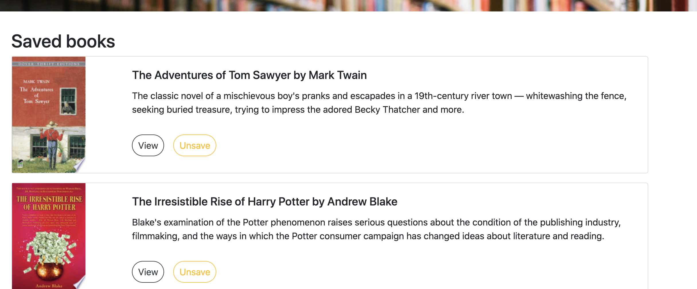

# React Book Search
Search for books via the Google Books API. Search, view, and save books.

 
 

## Challenges
Deployment to Heroku presented itself as a challenge on this assignment, and ultimately, I was forced to abandon my inital repo and deploy a server first and then incrementally add files.

## Images and Demo

### Demo

 
 

### Results Page

 
 

### Saved Books Page

 
 

## Contributors
Completed in collaboration with fellow students of the Georiga Tech Coding Boot Camp

## Links
[Repo](https://github.com/ad-fleming/book-search)
 
[Deployed App](https://book-search-adf.herokuapp.com/)

